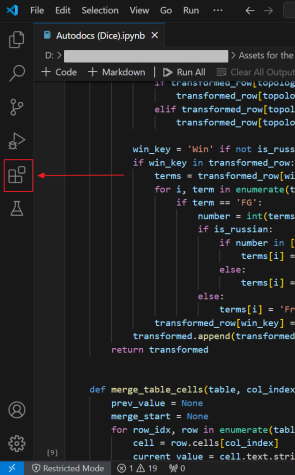
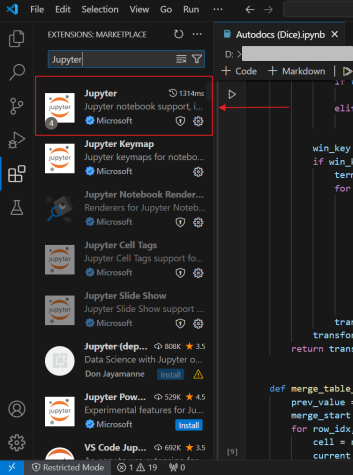

1. Проверьте, установлен ли у вас Python:
    * Откройте командную строку (**Win + R** и в поле ввода введите `cmd`).
    * Введите команду: `py -0`.
    * Если Python установлен, вы увидите его версию, например, `-V:3.13 *        Python 3.13 (64-bit)`. 

2. Установите Python (если не был найден на предыдущем шаге):
    - Скачайте Python с [официального сайта](https://www.python.org/downloads/).
    - Во время установки отметьте галочку **Add Python to PATH**.

3. Установите расширения Jupyter и Python для Visual Studio Code:
    - Откройте Visual Studio Code.
    - На панели инструментов в левой части экрана нажмите **Extensions**.

      

      *Выбор раздела Extensions*

    - В поле поиска введите *Jupyter*.
    - Выберите расширение из списка.

      

      *Выбор расширения Jupyter из списка*

    - В открывшейся вкладке нажмите **Install**.
    - В диалоговом окне нажмите **Trust Workspace & Install**.
    - Повторите все то же самое для расширения Python.

