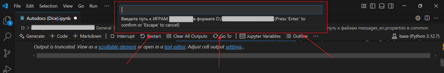

# Как формируются документы 
Во всех сценариях ниже код автоматически собирает два документа на русском и английском со следующими особенностями: 

- Титульный лист (шаблон без лого) добавляется из файлов `Title page.docx` и `Титульник.docx`. Из них же копируются стили документа.

    - Если изменился юридический адрес → замените его внутри файлов и сохраните.

- Раздел с риск-игрой добавляется из файлов `Gamble.docx` и `Риск-игра.docx`.

    - Если изменились тексты к риск-игре → замените их внутри файлов и сохраните.

- Разделы про линии/пути выплат, доступные ставки, номинал, RTP, таблицы с символами и выигрышными комбинациями создаются из сочетания: текст, прописанный в коде + данные из ГДД и страницы Math из Confluence (если такая есть).

    - Если изменились тексты в этих разделах:
      
        1\. Откройте файл с кодом в Visual Studio Code.
      
        2\. Нажмите **Ctrl+F**, введите в поле поиска текст, который нужно исправить.

        3\. Внесите необходимые изменения и сохраните файл.
      
        4\. Выполните код заново. В итоговых документах должен появиться исправленный текст.

- Тексты разделов с общим описанием и всеми фичами игр формируются путем парсинга файла `help.html`, сопоставления ключ-значение из файлов `messages_en.properties` и `messages_ru.properties` в локалях игры и в common.

- Лого, картинки с символами добавляются в документ из папки `..\GameName\source\graphics`.
   - Изображения символов часто в репозитории и html называются по-разному, в связи с чем могут быть проблемы с их вставкой в документ. Поэтому внимательно отсмотрите получившиеся документы и, если нужно, добавьте изображения или измените их порядок.

Скриншоты игры нужно сделать вручную, добавить в документы самостоятельно и затем, после всех проверок, сформировать PDF-файлы.

> Перед запуском убедитесь, что в папке `input_files/` находятся актуальные файлы `Title page.docx` и `Титульник.docx`, от которых будет взято оформление, а также `Gamble.docx` и `Риск-игра.docx`.

# Создание документов

## Новые игры

1. Откройте файл `..\techwriter\General\Assets for the code (E)\Autodocs (New).ipynb`в Visual Studio Code.

2. Нажмите **Run All**, чтобы запустить код.

3. Введите данные:

> Следуйте подсказкам в верхней части экрана.

- **Название игры** → введите в поле VS Code → **Enter**
- **Есть математика?**(**y/n**) → введите в поле VS Code → **Enter**
- **Ссылка на ГДД игры**
    - Появится пустое окно Chrome — оставьте его открытым.
    - Вставьте ссылку на ГДД в верхнее поле → нажмите **Enter**.
    - Введите логин и пароль от Confluence → сверните окно.
- **Ссылка на страницу с математикой** (только если есть) 
    - Через несколько секунд появится поле для ссылки → вставьте ссылку → **Enter**.
    - Подождите несколько секунд — данные автоматически добавятся в документы.
  
4\. После завершения работы кода откройте документы в папке по адресу` ..\games\GameName`.

5\. Проверьте, правильно ли загрузились изображения. При необходимости исправьте порядок, добавьте новые.

6\. Добавьте актуальные скриншоты игры.

7\. Сохраните как PDF-файл.

## Кастомные игры

1. Откройте файл `..\techwriter\General\Assets for the code (E)\Autodocs (Custom).ipynb`в Visual Studio Code.

2. Нажмите **Run All**, чтобы запустить код.

3. Введите данные:

> Следуйте подсказкам в верхней части экрана.

- **Название игры** → введите в поле VS Code → **Enter**
- **Игра-донор** → введите в поле VS Code → **Enter**
- **Есть математика?**(**y/n**) → введите в поле VS Code → **Enter**
- **Ссылка на ГДД игры**
    - Появится пустое окно Chrome — оставьте его открытым.
    - Вставьте ссылку на ГДД в верхнее поле → нажмите **Enter**.
    - Введите логин и пароль от Confluence → сверните окно.
- **Ссылка на страницу с математикой** (только если есть) 
    - Через несколько секунд появится поле для ссылки → вставьте ссылку → **Enter**.
    - Подождите несколько секунд — данные автоматически добавятся в документы.
   
4\. После завершения работы кода откройте документы в папке по адресу` ..\games\GameName`.

5\. Проверьте, правильно ли загрузились изображения. При необходимости исправьте порядок, добавьте новые.

6\. Добавьте актуальные скриншоты игры.

7\. Сохраните как PDF-файл.

## Dice-игры

!!! Важно
    Если в ресурсах игры нет папки `html` и файла `help.html`, перед запуском кода скопируйте их из оригинальной игры. Их не     нужно коммитить. После успешного выполнения кода просто удалите папку.

1. Откройте файл `..\techwriter\General\Assets for the code (E)\Autodocs (Custom).ipynb`в Visual Studio Code.

2. Нажмите **Run All**, чтобы запустить код.

3. Введите данные:

> Следуйте подсказкам в верхней части экрана.

- **Название игры** → введите в поле VS Code → **Enter**
- **Есть математика?**(**y/n**) → введите в поле VS Code → **Enter**
- **Ссылка на ГДД игры**
    - Появится пустое окно Chrome — оставьте его открытым.
    - Вставьте ссылку на ГДД в верхнее поле → нажмите **Enter**.
    - Введите логин и пароль от Confluence → сверните окно.
- **Ссылка на страницу с математикой** (только если есть) 
    - Через несколько секунд появится поле для ссылки → вставьте ссылку → **Enter**.
    - Подождите несколько секунд — данные автоматически добавятся в документы.

4\. После завершения работы кода откройте документы в папке по адресу` ..\games\GameName`.

5\. Проверьте, правильно ли загрузились изображения. При необходимости исправьте порядок, добавьте новые.

6\. Добавьте актуальные скриншоты игры.

7\. Сохраните как PDF-файл.
