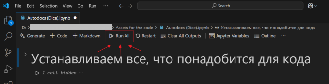

> Перед запуском убедитесь, что в папке `input_files/` находится актуальный файл `TitlePage.docx`, от которого будет взято оформление.

!!! Dice-игры
      Если в ресурсах игры нет папки html и файла *help.html,* перед запуском кода скопируйте их из оригинальной игры. 
      Их не нужно коммитить. После успешного выполнения кода просто удалите папку.

1. Откройте один из файлов *Autodocs (New)/* *Autodocs (Dice)*/ *Autodocs (Custom)* в Visual Studio Code:
     - **Autodocs (New)** - для новых игр;
     - **Autodocs (Dice)** - для Dice-игр;
     - **Autodocs (Custom)** - для кастомных игр.
2. Нажмите **Run All**, чтобы запустить код.

        

3. Введите данные

      > Следуйте подсказкам в верхней части экрана.

      

      <ol type="1">
      <li><strong>Название игры</strong> → введите в поле VS Code → <strong>Enter</strong></li>
      <li><strong>Игра-донор</strong> (для кастомных) → введите в поле VS Code → <strong>Enter</strong></li>
      <li><strong>Есть математика?</strong> (<strong>y/n</strong>) → введите в поле VS Code → <strong>Enter</strong></li>
      <li><strong>Ссылка на ГДД игры</strong>
         <ol type="1">
            <li>Появится пустое окно Chrome — оставьте его открытым.</li>
            <li>Вставьте ссылку на ГДД в верхнее поле → нажмите <strong>Enter</strong>.</li>
            <li>Введите логин и пароль от Confluence → сверните окно.</li>
         </ol>
      </li>
      <li><strong>Ссылка на страницу с математикой</strong> (только если есть математика) 
         <ol type="1">
            <li>Через несколько секунд появится поле для ссылки → вставьте ссылку → <strong>Enter</strong>.</li>
            <li>Подождите несколько секунд — данные автоматически добавятся в документы.</li>
         </ol>
      </ol>
